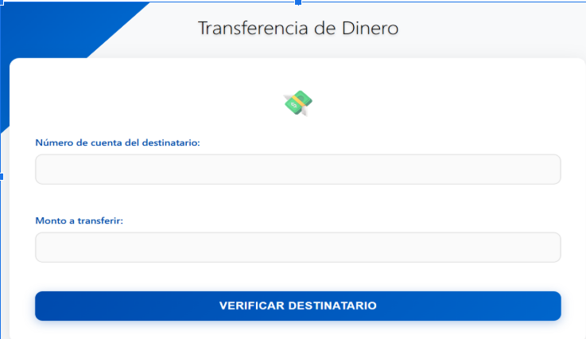
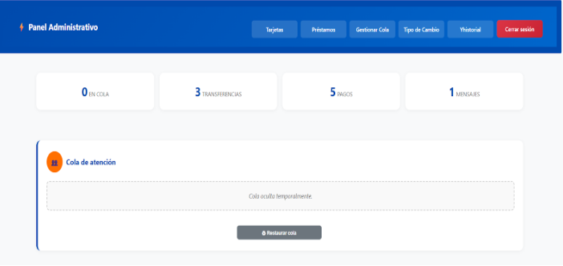
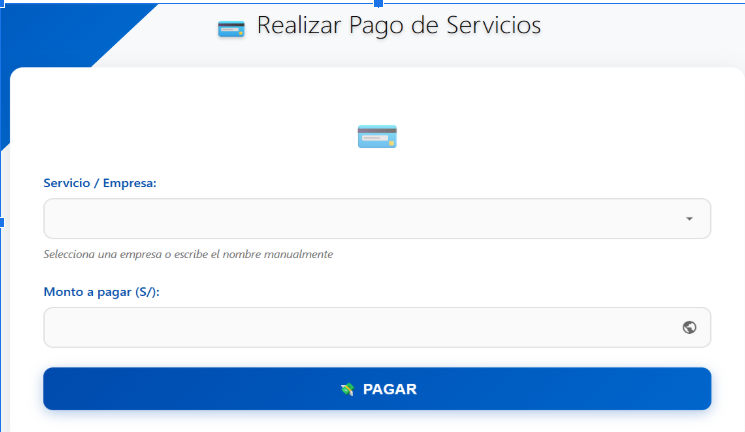
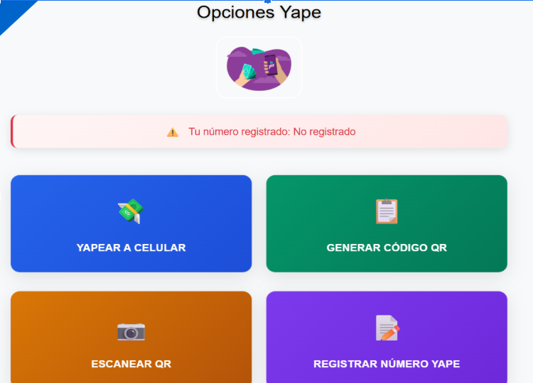

# Simulador Bancario - Plataforma de Operaciones Financieras

## Índice

1. [Resumen Ejecutivo](#resumen-ejecutivo)
2. [Autores](#autores)
3. [Carrera y Contexto Académico](#carrera-y-contexto-académico)
4. [Objetivos del Proyecto](#objetivos-del-proyecto)
5. [Justificación](#justificación)
6. [Aporte Social y Educativo](#aporte-social-y-educativo)
7. [Ventajas y Beneficios](#ventajas-y-beneficios)
8. [Motivación Tecnológica (Colas como motor del proyecto)](#motivación-tecnológica-colas-como-motor-del-proyecto)
9. [Tecnologías y Herramientas Utilizadas](#tecnologías-y-herramientas-utilizadas)
10. [Arquitectura del Proyecto](#arquitectura-del-proyecto)
11. [Diseño de la Base de Datos](#diseño-de-la-base-de-datos)
12. [Módulos Desarrollados](#módulos-desarrollados)
13. [Guía Completa de Instalación y Ejecución](#guía-completa-de-instalación-y-ejecución)
14. [Compatibilidad y Requisitos de Hardware](#compatibilidad-y-requisitos-de-hardware)
15. [Manual de Usuario - Guía Práctica](#manual-de-usuario---guía-práctica)
16. [Manual Técnico](#manual-técnico)
17. [Aspecto Económico](#aspecto-económico)
18. [Cronograma y Tiempos de Desarrollo](#cronograma-y-tiempos-de-desarrollo)
19. [Equipo de Desarrollo](#equipo-de-desarrollo)
20. [Licencia y Uso del Proyecto](#licencia-y-uso-del-proyecto)
21. [Capturas de Pantalla - Interfaz de la Aplicación](#capturas-de-pantalla---interfaz-de-la-aplicación)
22. [Conclusiones Finales](#conclusiones-finales)

---

## Resumen Ejecutivo

Este proyecto consiste en la creación de un **Simulador Bancario Educativo**, que permite emular las operaciones más comunes dentro de una entidad financiera...

🚨 La plataforma tiene fines exclusivamente académicos y no representa transacciones reales.

---

## Autores

**Equipo N° 7**  
Curso: *Algoritmos y Programación en Python*  
Ciclo: *3° Ciclo*  
Carrera: *Diseño y Desarrollo de Software*

---

## Carrera y Contexto Académico

Proyecto desarrollado como simulador funcional para la asignatura...

👨‍💼 **Camasca Macedo, Charles Dummar**

---

## Objetivos del Proyecto

👉 Simular operaciones de una entidad bancaria digital.  
👉 Reforzar habilidades de programación...  
👉 Aplicar teoría de colas...  
👉 Desarrollar un sistema modular...

---

## Justificación

Hoy en día, el sector financiero digital es esencial...

---

## Aporte Social y Educativo

**Educativo:** Aprendizaje práctico sobre desarrollo de sistemas financieros.  
**Social:** Sensibilización sobre el funcionamiento de las apps bancarias...  
**Tecnológico:** Formación en tecnologías...

---

## Ventajas y Beneficios

👉 Simulación sin riesgos económicos...  
👉 Reforzamiento de conocimientos teóricos...

---

## Motivación Tecnológica (Colas como motor del proyecto)

El concepto de colas es esencial en sistemas reales...

---

## Tecnologías y Herramientas Utilizadas

| Área          | Herramienta                        |
| ------------- | ---------------------------------- |
| Lenguaje      | Python                             |
| Backend       | Flask                              |
| Frontend      | HTML5, CSS3, Bootstrap             |
| Base de Datos | PostgreSQL (adaptable a MySQL)     |
| Otros         | JavaScript (mínimo), VS Code, Git  |

---

## Arquitectura del Proyecto

La aplicación sigue el esquema cliente-servidor...

---

## Diseño de la Base de Datos

Modelo relacional con integridad referencial y normalización...

---

## Módulos Desarrollados

👉 Registro/Login con seguridad básica...  
👉 Transferencias tradicionales y por Yape...  

---

## Guía Completa de Instalación y Ejecución

# Clona el proyecto
git clone <url_del_proyecto>
cd <carpeta_del_proyecto>

# Crea y activa entorno virtual (opcional pero recomendado)
python -m venv venv
source venv/bin/activate  # En Linux/Mac
venv\Scripts\activate     # En Windows

# Instala Flask y dependencias
pip install -r requirements.txt  # si tienes este archivo
# o manual:
pip install flask psycopg2

flask run
Luego ve a:
👉 http://localhost:5000 (por defecto Flask usa el puerto 5000, no 8000 a menos que lo especifiques).

---

## Compatibilidad y Requisitos de Hardware

| Requisito      | Especificación Mínima |
| -------------- | --------------------- |
| Procesador     | Intel i3 o superior   |
| Memoria RAM    | 4 GB                  |
| Almacenamiento | 500 MB disponible     |
| Navegadores    | Chrome, Firefox, Edge |
| SO Compatible  | Windows, Linux, macOS |

---

## Manual de Usuario - Guía Práctica

* Iniciar sesión con un usuario registrado...  
* Visualizar saldos y operaciones...  

---

## Manual Técnico

* Backend en flask ...  
* Base de datos adaptable...  
* Documentación interna por cada módulo...

---

## Aspecto Económico

Solución de bajo costo...

---

## Cronograma y Tiempos de Desarrollo

* Semana 1-2: Análisis, diseño...  
* Semana 3-4: Backend...  
* Semana 5: Frontend...  
* Semana 6: Pruebas y entrega...

---

## Equipo de Desarrollo

**Equipo N° 7** - Carrera Diseño y Desarrollo de Software  
Curso: *Algoritmos y Programación en Python*  
Guía Académico: *Camasca Macedo, Charles Dummar*

---

## Licencia y Uso del Proyecto

Proyecto de uso exclusivamente académico...

---

## Capturas de Pantalla - Interfaz de la Aplicación

  
  
  
  

---

## Conclusiones Finales

Este simulador bancario permitió a los estudiantes integrar conocimientos...

🚨 El sistema es académico, no representa operaciones reales...
